# Contact Potential

- Consider two separate doped materials - p and n types

- Upon joining the two, the concentration gradient between holes and electrons in the two regions causes mobile charge carriers to diffuse into each other

  - Thus, holes from the p-side will diffuse to n and electrons from the n-side will diffuse to p

- However, this cannot happen indefinitely

  - Since the particles are charged, crossing over the junction leaves behind space charges
  - The space charges themselves are the uncompensated donor and acceptor atoms
  - The electrons leaving the n side leaves behind positive charge carriers $N_d^+$, and the holes leaving the p side leaves behind negative charge carriers $N_A^-$

  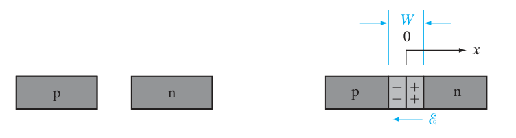
  
  ​	

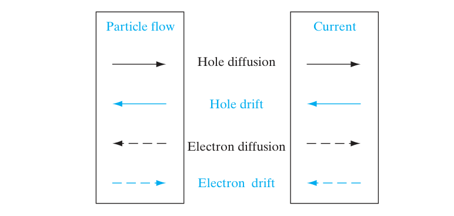

- Thus, $\mathcal{E}$ - electric field will be pointing from positive to negative - or from the n-doped side to the p-doped side

- At equilibrium, no next charge flow can occur

  - In other words, the diffusion current and the drift current must cancel out to zero
  - In math terms:


```math
J_p (drift) + J_p(diff.) = 0 \\ J_n(drift) + J_n(diff.) =0
```

- Therefore, the electric field builds up to the point where the net current is zero
- This electric field exists in some region *W*, and there is some equilibrium potential difference across the junction $V_0$

  - This potential is otherwise known as a built-in potential, specifically a contact potential since it arises from the *contact* of the two doped materials
  - This electric field is dictated by:


```math
\mathcal{E} = - \frac{d\mathcal{V(x)}}{dx}
```

- Note that the electric field is the negative of the change in potential difference
  - As the potential goes from positive to negative, that will be the direction of $\mathcal{E}$
- The contact potential separates the bands by the amount $qV_0$ in order to ensure that the fermi levels match throughout the junction

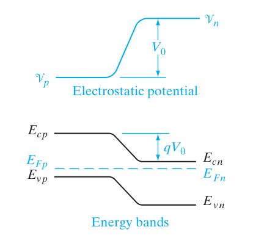

- The quantitative relationship between $V_0$ and the doping concentrations between each sides can also be found:

  - Skipping the boring details:


```math
\begin{align*}
J_p(x) &= q\left[\mu_p p(x) \mathcal{E}(x) - D_p \frac{dp(x)}{dx}\right] = 0
\end{align*}
```

- Plug in Einstein relation and integrate over the right bounds to get:

```math
V_0 = \frac{kT}{q} * \ln \left(\frac{p_n}{p_p}\right)
```

- Assuming that the material has $N_a$ acceptors and $N_d$ donors, we can plug in to get
  

```math
V_0 = \frac{kT}{q} \ln\frac{N_a}{n_i^{2}/N_d} = \frac{kT}{q} \ln\frac{N_a N_d}{n_i^{2}}
```

- Rearranging the equation for the ratio of $p_p$ and $p_n$:


```math
\frac{p_p}{p_n} = \frac{n_n}{n_p} = e^{\frac{qV_0}{kT}}
```

- which can be useful for calculating I-V characteristics

> An equation that comes up often from previous chapters is
> ```math
> \begin{align*}
> n_0 &= n_i e^{\frac{E_f - E_i}{kT}} \\ 
> E_f - E_i &= kT \ln\frac{n_0}{n_i} 
> \end{align*}
> ```
>
> The equivalent relationship holds for holes, and lets you find the distance from the intrinsic level to the fermi level for both sides of the junction

# Equilibrium Fermi Level

- At equilibrium, the fermi level is constant throughout the material
  - If it wasn't, the carriers in one region would migrate to the region with a lower fermi energy level - which wouldn't be equlibrium
- From this conclusion and some derivation I won't write :joy: but boils down to equating $p$ ratio to e equation you get:

```math
qV_0 = E_{vp} - E_{vn}
```

- which means to say that the contact potential / strength of the electric fields is equal to the difference in the energies of the valence bands at equilibrium
  - This makes sense, as the fermi level MUST be equal at equilibrium, so the potential caused will lift the bands to accomplish this
  - Another way to look at this is that the "chemical potential" of the electrons must be equal - which is kinda what the fermi level is saying

# Space Charge at Junction

- To make the junction diagram more simple, the *depletion approximation* is made

  - At any given time, there are relatively few charge carriers within the region of the electric field
    - On the n-side, the majority carriers of the electrons are pushed away by the electric field -- unable to overcome the potential difference 
    - The same thing occurs on the p-side, as the electric field points towards it, repelling the holes
  - This allows us to ignore mobile charge carriers, so the only charges needed to be accounted for are just the space charges of the uncompensated donors and acceptors that exist within the region *W*
- To bound the electric field within the region *W*, there must be an equal number of charge carriers on both sides, which is given by the equation:

```math
qAx_{p0}N_a=qAx_{n0}N_d
```

- where A is the cross-sectional area of the sample, $x_{p0}$ and $x_{n0}$ are the penetration into the p region of the sample and the n region of the sample, and $N_a$ and $N_d$ are the density of acceptor and donor atoms 

- A key part of this equation is that if the doping levels are not equal between the two samples, the penetration into the more lightly doped side must increase in order to *"sweep"* up more charge 

  - The total width of the region is naturally $x_{p0} + x_{n0}$ 

- To calculate the electric field distribution within the region, the *Poisson Equation* is used to relate the electric field gradient to the space charge density

  - Ignoring the space charges and assuming complete ionization, we get

  ```math
  \begin{align*}
  \frac{d\mathcal{E}}{dx} = \frac{q}{\epsilon} N_d && 0 < &x < x_{n0} \\  
  \frac{d\mathcal{E}}{dx} = -\frac{q}{\epsilon} N_a && - x_{p0}< &x < 0 
  \end{align*}
  ```

  - From these equations, the electric field becomes more negative up to zero, before increasing past the boundary and going into the n-doped region
  - Thus, the maximum of the field will be at zero and it will overall look like a triangle
  - The value of the electric field can easily be found with integration:

  ```math
  \int_{\mathcal{E_0}}^0 d\mathcal{E} = \frac{q}{\epsilon} N_d \int_0^{x_{n0}} dx
  ```

  ​	from 0 < x < $x_{n0}$

- Either equation can be used, but for this example using the n-side

  - Note that both sides will be negative, so the signs work out

- Therefore, the maximum value of the electric field is:

```math
\mathcal{E}_0 = - \frac{q}{\epsilon}N_d x_{n0} = \frac{q}{\epsilon}N_a x_{p0}
```

- To find the potential difference via this method, integrate from the bounds of the sample to $\mathcal{E}(x)$
- Since the potential overall makes a triangle, $\frac{1}{2} bh$, we take the base to be the width of the depletion region and the height to be $\mathcal{E}(x)$ 
- Overall, this gives

```math
V_0 = \frac{1}{2} \mathcal{E_0}W = \frac{1}{2}\frac{q}{\epsilon}N_dx_{n0}W
```

 where we substitute in the found value of $E_0$ from the previous equation

- To get rid of the $x_{n0}$ term and to eventually solve for the width of the depletion region, we use the relation

```math
\begin{align*}
x_{n0}N_d &= x_{p0}N_a \\
x_{n0} &= \frac{x_{p0}N_a}{N_d}
\end{align*}
```

- plug it into the definition of the width of the depletion region

```math
W = x_{n0} + x_{p0} \\ 
x_{n0} = \frac{N_a}{N_a + N_d} W
```

- and then solve for width, yielding the equation:

```math
W = \left[\frac{2\epsilon V_0}{q} \left(\frac{N_a + N_d}{N_aN_d}\right)\right]^{1/2} = \left[\frac{2\epsilon V_0}{q} \left(\frac{1}{N_a} + \frac{1}{N_d}\right)\right]^{1/2}
```

- Several useful variations by plugging in terms:


# Forward and Reverse Bias Junctions

- Typically, the range of the voltage drop is restricted to the depletion region
- When a forward voltage bias is applied to the junction region, the electrostatic barrier is lowered by amount $V_f$ from the equilibrium junction amount $V_0$ to $V_0 - V_f$ 
- When a reverse voltage bias is applied to the junction region, the electrostatic barrier is increased and the valence band is depressed in relation to eq.

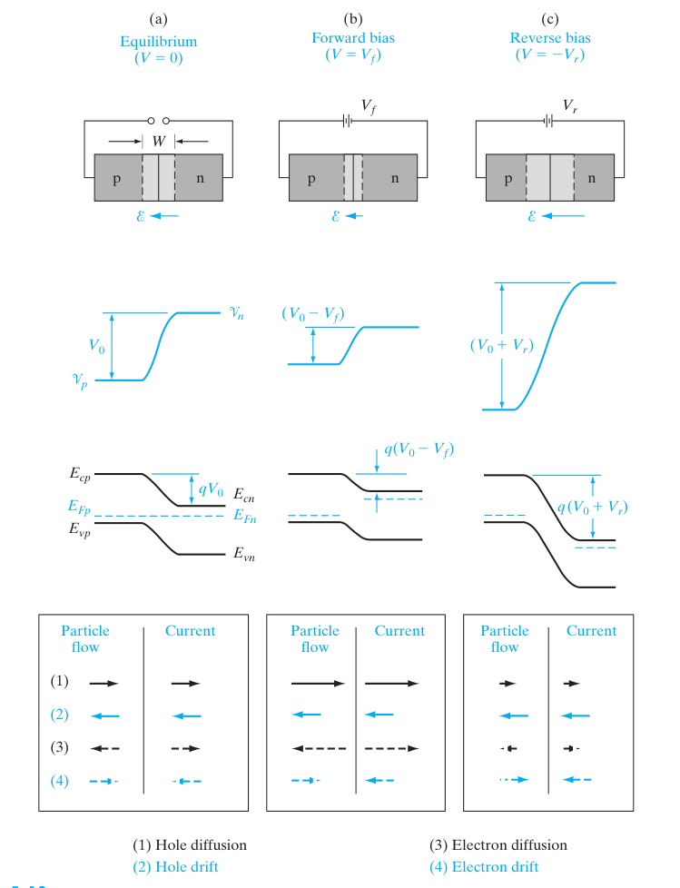

- This chart gives a nice summary
  - Forward bias reduces built-in potential, reverse bias increases potential
- The biases also change the location of the fermi levels on each side of the junction as shown in the picture 
  - When a forward bias is applied, $E_{fn}$ is raised above $E_{Fp}$ by the amount $qV_f$ 
  - The reverse is true for a reverse bias
- The diffusion current is composed mainly of majority carriers with enough energy to overcome the shortened barrier under forward bias, so electrons going from n to p, and holes from p to n 
- Here, the drift current doesn't really matter when no bias is applied, as not many electrons are free to be swept by the electric field due to thermal limitations


- The only current generated across the barrier is the relatively small EHP minority carriers by thermal excitation- creating a current known as the *generation current*
  - This current is present even when a reverse bias is applied to the junction
- At equilibrium, the generation current caused by the electric field is equally balanced by the current caused by diffusion of n and p carriers 
- As the voltage across the junction is changed, the current changes as shown in the graph. This is given by the equation:

```math
I = I_0 \left(e^\frac{qV}{kT}-1 \right)
```

- At high reverse voltages, the $I_0$ term dominates in the negative direction, but when the voltage gets high enough, the exponential term dominates, causing a large exponential growth

  - The negative generation current is also called the reverse saturation current

  # Carrier Injection

- The amount of minority carriers in naturally expected to be correlated with the applied bias due to variations in the diffusion current across the junction
- At eq.

$$
\frac{p_p}{p_n}= \exp\left(\frac{q(V_0)}{kT} \right)
$$

- When a bias is applied, the amount of majority carriers is expected to barely change, but the amount of minority carriers is expected to increase by orders of magnitude

```math
\frac{p(-x_{p0})}{p(x_{n0})} = \exp\left(\frac{q(V_0 - V_f)}{kT} \right)
```

- This can be rewritten in terms of the equilibrium minority carrier concentration as:
  

```math
\frac{p(x_{n0})}{p_n} = \exp\left(\frac{qV}{kT} \right)
```

- This exponential increase in minority carriers caused by a forward bias is called a *minority carrier injection*

- The increase in eq. concentration can easily be calculated by rearranging terms

```math
\Delta p_n = p_n \left(\exp\frac{qV}{kT} -1 \right)
```

```math
\Delta n_p = n_p \left(\exp\frac{qV}{kT} -1 \right)
```


- As holes diffuse deeper into the n region, and electrons in the p region, recombination is expected and the number of minority carriers will decrease, causing an exponential decrease in the diffusion as the carriers travel

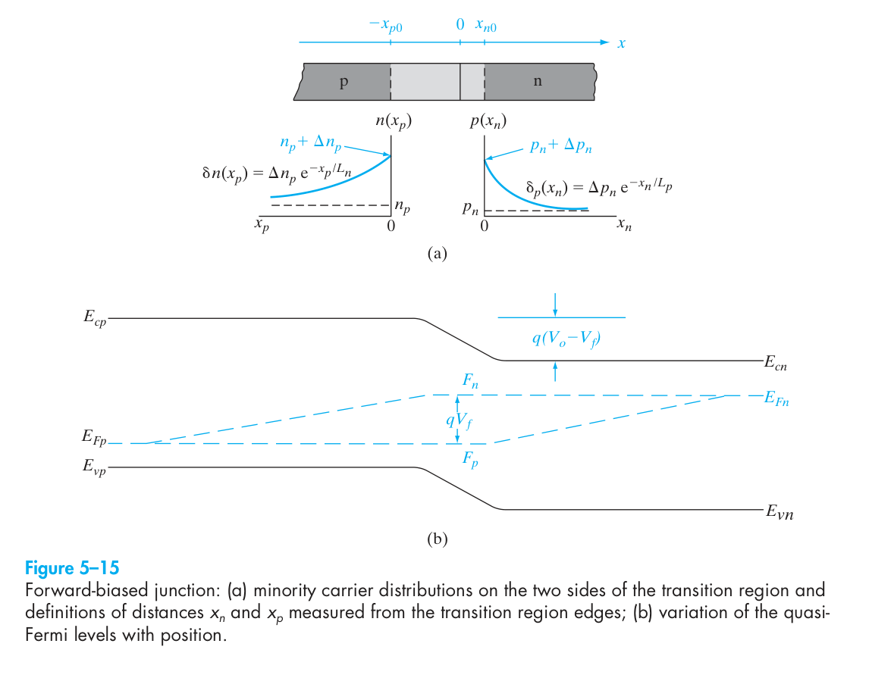

# Reverse Bias Breakdown

- At a high enough reverse voltage, a *reverse breakdown* occurs, where the current drops almost a right angle given a extreme enough negative voltage

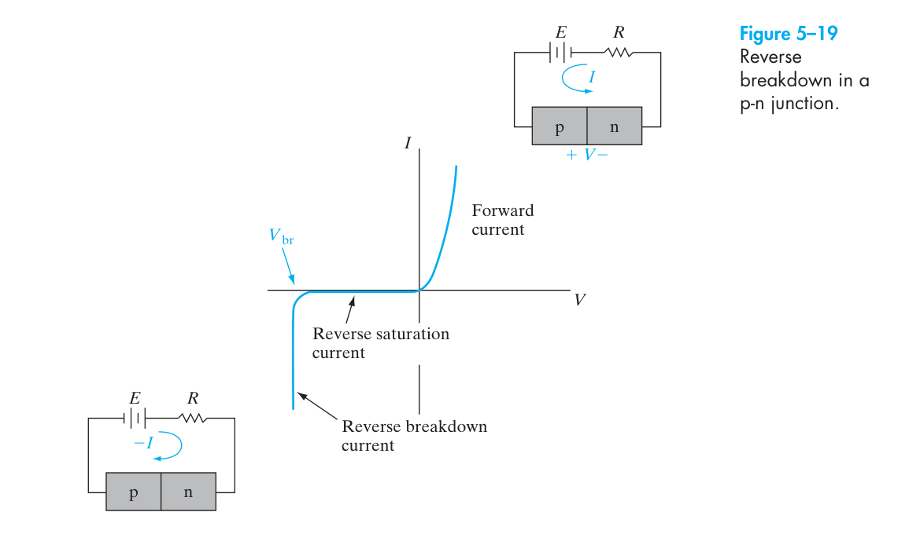

- There are two mechanisms for this to occur
  - *Zener Effect*
  - *Avalanche Breakdown*
- Zener Effect:
  - When a heavily doped junction is reverse biased, the energy bands become crossed at some voltage V
    - I.E the n side conduction band appears opposite / at the same level as the p side valence band
  - If the barrier between the two bands is narrow enough, the electrons can tunnel to access the large amount of empty states in the p side valence band

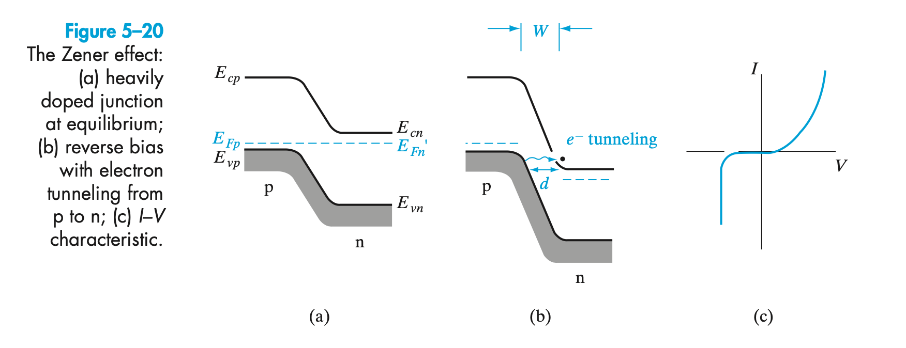

- Avalanche Breakdown

  - If the reverse bias is high enough, electrons from the p side (minority carriers) can essentially be slingshot by the electric field into the n side, causing the creation of an EHP via *impact ionization*
  -  If the collision occurs with enough kinetic energy, the resulting electron can also participate in impact ionization, leading to an avalanche of minority carriers to try to cross the barrier

  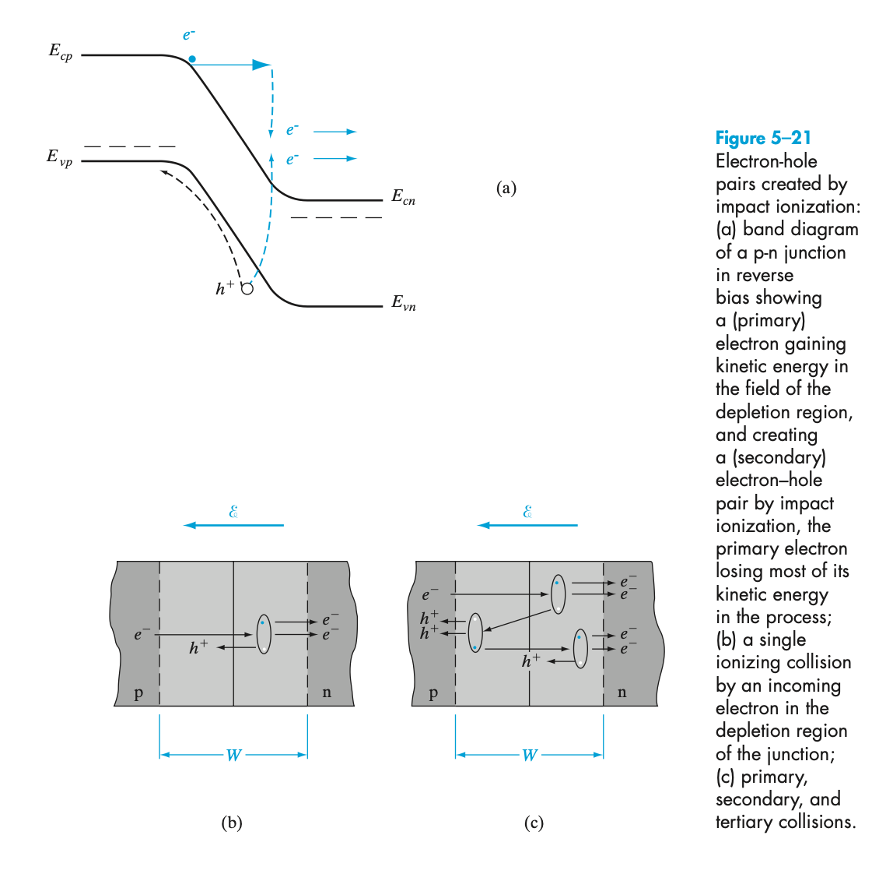

# Schottky barriers 

- For a metal, the energy required to remove an electron from the fermi level and into the vacuum is the work function $q\phi_m$ 
  - For Au, the value ranges from 4.3 to 4.8V 
- When negative charges are moved near the surface of a metal, positive (*image*) charges are attracted to the surface
- When this image force is combined with an applied electric field, the effective work function is somewhat reduced
- This type of barrier lowering is called the *Schottky Effect*
  - More specifically, when a metal is brought into contact with a semiconductor with work function $q\phi_s$, charge transfer occurs until the fermi levels align at equilbrium
  - The fermi level of the semiconductor is lowered, and the fermi level of the metal is raised
  - The bands bend towards the metal approximately the same as in a p-n junction
- The equilibrium contact potential $V_0$ which prevents further net electron diffusion from semiconductor to metal is the difference in the work function potentials or:

```math
qV_0 = q(\phi_m- \phi_s)
```

> The alignment of the work functions works the same way as the alignment of the valence bands for a p-n junction conceptually. The work function lies a fixed energy level above the fermi levels, so when they align, they will naturally have the same work function

- The potential needed to move an electron from the metal to a semiconductor when fermi levels are equal is $\phi_b$ defined as:

  ```math
  q \phi_b = q\left(\phi_m - \chi\right)q \phi_b = q\left(\phi_m - \chi\right)
  ```

- In a p-type semiconductor with $\phi_m < \phi_s$, it requires postive charge on the metal side and negative charge on the semiconductor side of the junction.

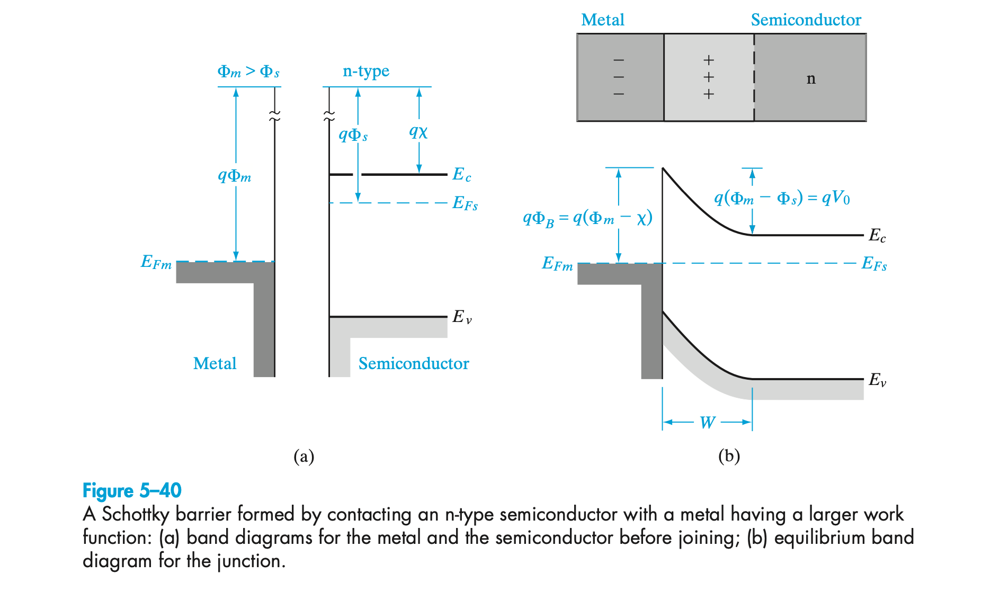

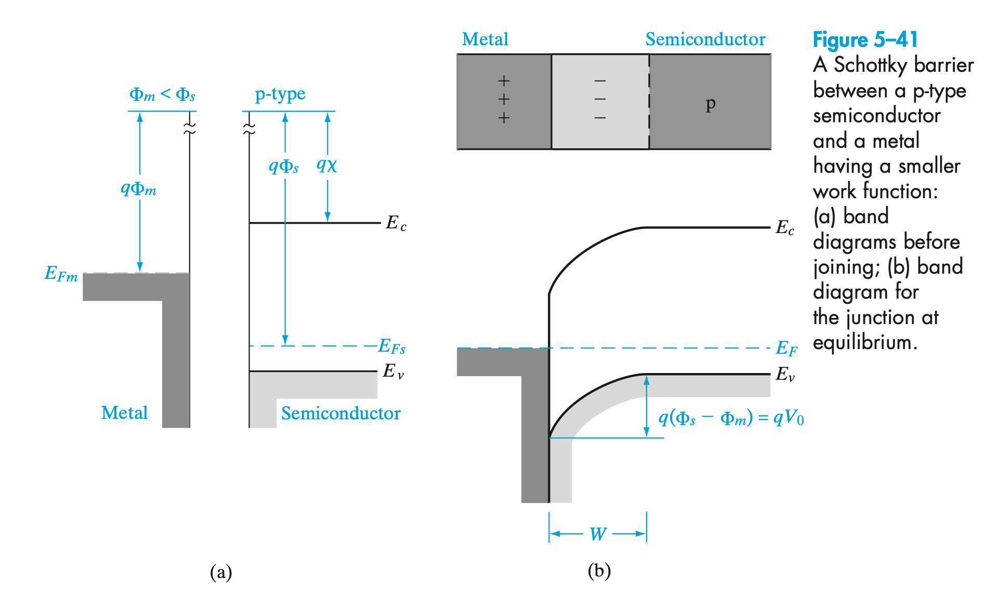

- Overall, mechanism is analogous, but for holes. Note that the work function for a rectifying contact has the $\phi_s > \phi_m$ :

```math
qV_0 = q\phi_s - q\phi_m \\
```

# Rectifying Contacts

- When a forward bias is applied to a Schottky barrier, the potential is reduced to $V_0 - V$, and the fermi level of the semiconductor is effectively raised

- As a results, electrons in the semiconductor can diffuse across the depletion region in the material, giving rise to a forward current in the material

- In the reverse bias case, a reverse saturation current is generated, however...

  - The saturation current depends on the size of the barrier for electron injection $\phi_b$ which is unaffected by bias voltage

- This leads to the relation:

  ```math
  I_0 \propto \exp \frac{-q\phi_b}{kT}
  ```

  

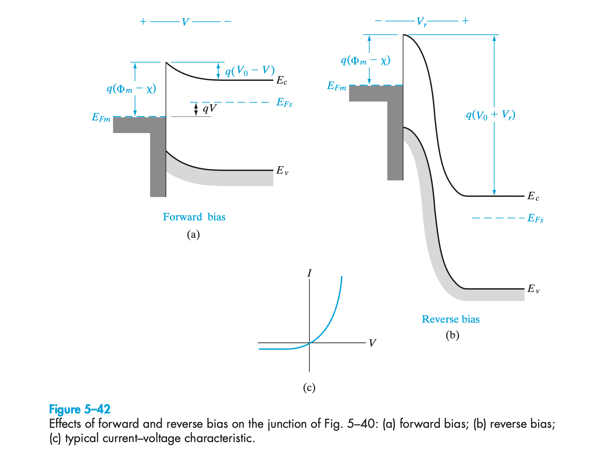

For a p-type:

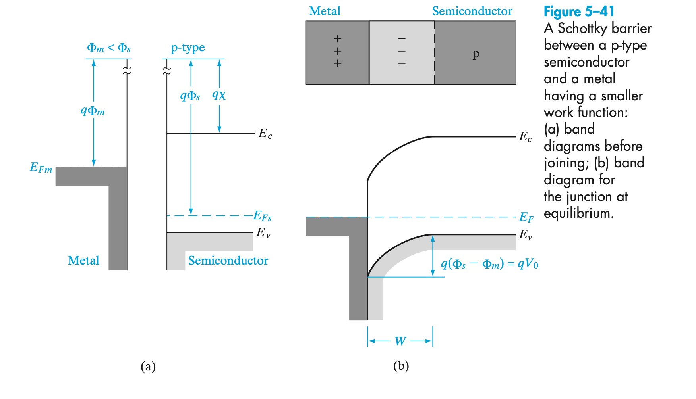

- Note: The barrier $\phi_b$ does not change with bias, only the potential barrier of electrons / carriers flowing from the semiconductor to the metal changes

# Ohmic Contact

- Often, the exponential nature that arises when a forward bias is applied through a material is not wanted
- Instead, a linear relation with the voltage is desired
- This is able to be achieved if the majority carriers present in the dopant are transferred from the metal to the semiconductor
  - For an n-type, this would mean electrons flowing from the metal to the semiconductor
  - For a p-type, this would mean holes flowing from the metal to the semiconductor 
- This can occur in two ways:

```math
\begin{cases}
\phi_m < \phi_n & n-type \\ 
\phi_m > \phi_p  & p-type
\end{cases}
```


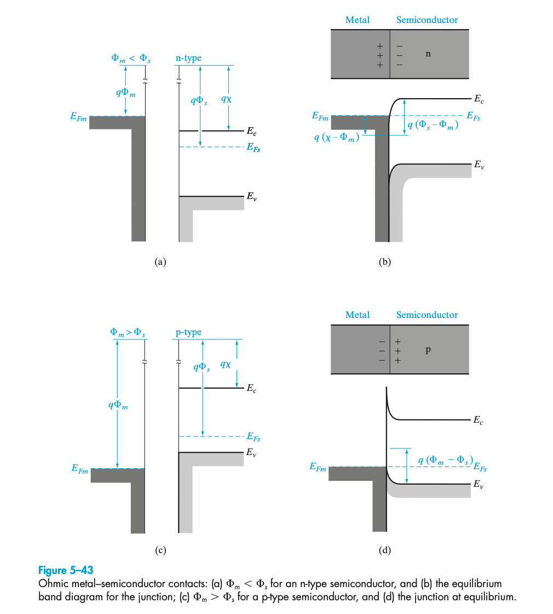

