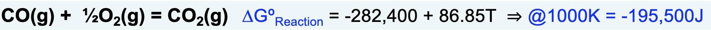
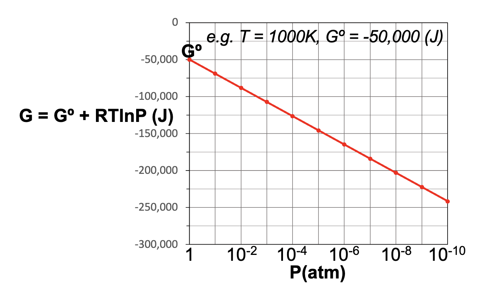
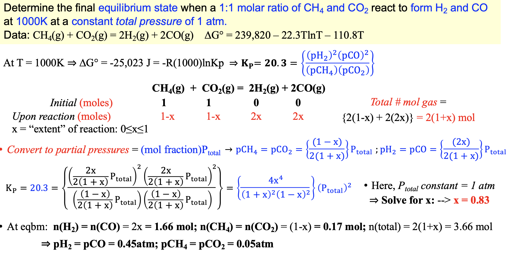
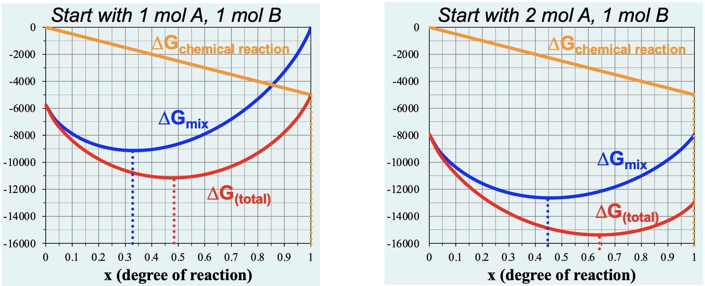

# Gaseous Reaction Equilibrium

- Given a reaction between gasses, what determines how far the reaction proceeds?
  - Ex. If you react 3 mol $CO$ with 1.5 mol $O_2$, will 3 mol $CO_2$ be produced?
- For a reaction between gasses, all the present species will survive due to entropy considerations
- For a favorable reaction at 1 atm, the $\Delta G\degree$ is highly negative
- Ex.



- As the reaction proceeds, the pressure of the reactants decreases, increasing their entropy; how much?

- Given by:

```math
\Delta G = \Delta G \degree + RT\ln \mathcal{P}
```

- In other words, by the reactants lower their pressure, the two sides can find a balance



- To represent the $\Delta G\degree_{\mathrm{molar}}$ of a substance, the notation is switched to $\mu \degree$ or in other words the chemical potential
- The place in which the reaction actually reaches equilibrium is determined when $\Delta \mu = 0$ , or the chemical potential does not change between sides

- To determine this, split up each term into its base case consideration at 1 atm, and then adjust each component for the pressure entropy change
- For $CO_2$ combustion:

```math
\left[\mu \degree (CO_2) + RT \ln (\mathcal{P}_{CO_2})\right] - \{ \frac{1}{2} \left(\mu \degree (O_2) + RT \ln (\mathcal{P}_{O_2}) \right)\ + \mu \degree(CO) + RT \ln (\mathcal{P}_{CO})  \}
```

- Collecting the terms yields:

```math
\begin{align*}
\Delta G &= \Delta G \degree +RT \ln\left(  \frac{p_{CO_2}}{(p_{CO})(p_{O2})^{1/2}}   \right) \\ 
&= \Delta G \degree + RT \ln(K_p)
\end{align*}
```

- At equilibrium, $\Delta G$ must equal zero

```math
\Delta G \degree = -RT \ln(K_p)
```

- Notice, the term $K_p$ is not dependent on the total pressure of the system, rather only the ratio of components within the system
- $K_p$ is reliant on the temperature however, as doing the partial with respect to temperature yields:

```math
\left(\frac{\delta \ln(K_p)}{\delta T } \right) = \frac{\Delta H \degree}{RT^2}
```

- If $\Delta H > 0$, such as in an endothermic reaction, increasing the T would lead to a shift towards the products
- If $\Delta H < 0$, such as in an exothermic reaction, increasing the T would lead to a shift towards the products
- If the reaction is not at equilibrium, we can solve for the current ratio of pressures to find the reaction quotient, which will dictate the direction the reaction is heading

```math
\frac{p_{CO_2}}{(p_{CO})(p_{O2})^{1/2}} = Q_p
```

- The $\Delta G$ found when plugging in these values tells you the "driving force" for the reaction at that time-step
- To solve typical problems, make an ice table



- The key steps are

  - Find $K_q$ via equation 
  - Find number of total moles via ice table (where x is the extent of the reaction)
  - Divide number of moles per component by total moles to find mole fraction
  - Multiply mole fraction by $P_{total}$ to get pressure of each component
  - Plug into $K_q$ definition and solve for the values

  # Le Chatelier's Principle

  - When additional reactants are added to a reaction at equilibrium, the position of the equilibrium shifts in the opposite direction
    - Importantly, this also consumes / changes amount of other reactant - even if no additional amount of that is added
  - Explanation:
    - Adding more of the reactants will shift the $\Delta G_{\mathrm{mix}} $ to a higher completion amount




- The minimum $\Delta G_{\mathrm{Mix}}$ always moves away from the direction of the added gas