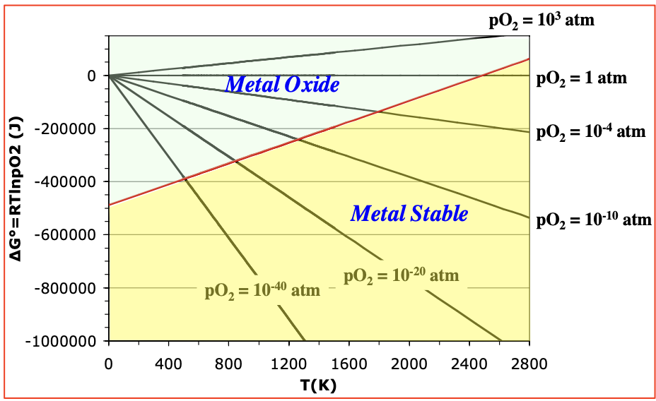
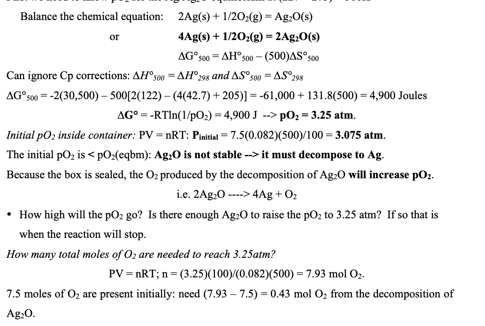
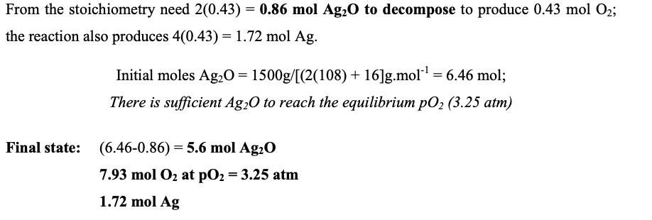
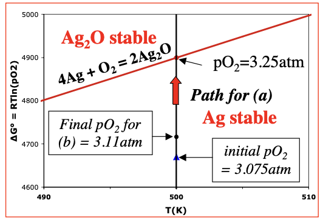
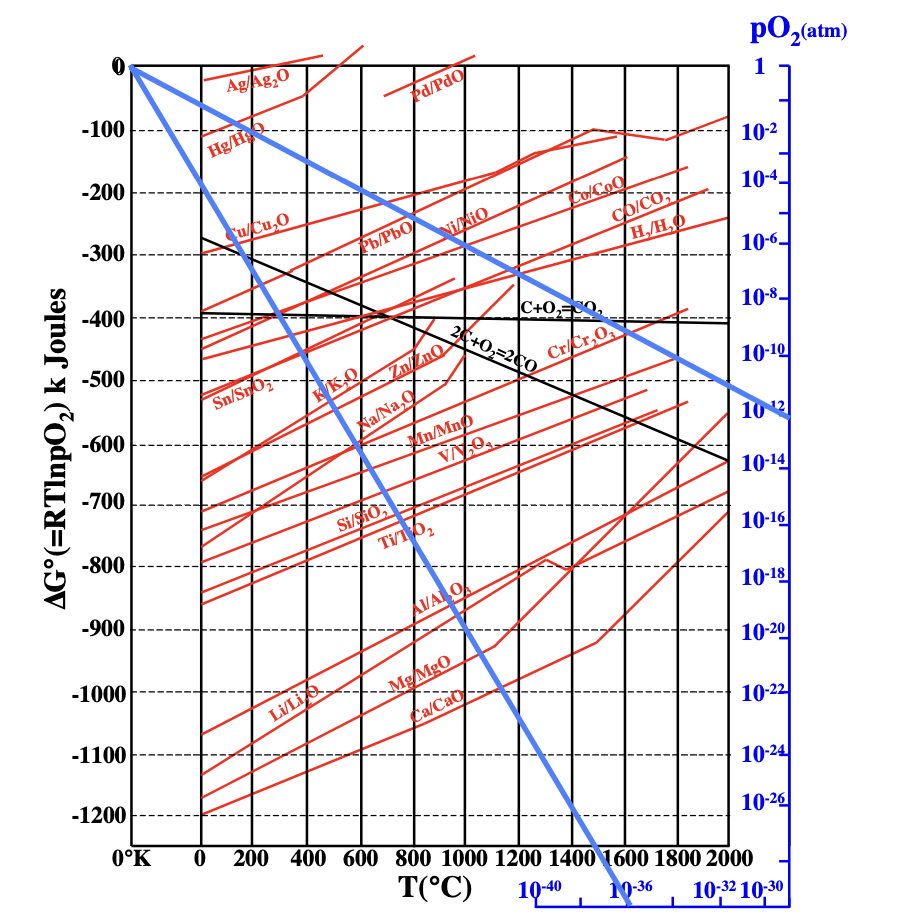

# Metal-Metal Oxide Reaction Equilibria

- For the reaction:

```math
\mathrm{Ni(s) + \frac{1}{2}O_2(g) = NiO(s)} 
```

- In the right direction, Ni is getting oxidized
- In the left, NiO is getting reduced
- In this situation, there are three possible cases emerge
  - Right Side Stable -> Pure NiO
  - Left Side Stable -> Pure Ni
  - Equilibrium -> Pure Ni + Pure NiO
- Note that in all three reaction, $O_2$ is always present; In the second case, its pressure would be lower 
- At equilibrium

```math
\Delta G =0: \mu_T\mathrm{Ni(s)} +\frac{1}{2}\mu_T\mathrm{O_2(g)} = \mu_T\mathrm{NiO(s)}
```

- For $O_2$ gas:

```math
\mu_T\mathrm{O_2}(g) = \mu \degree + RT \ln(\mathrm{O_2})
```

- Solids at equilibrium remain the same, as **solids cannot adjust there free energy with pressure*

- Therefor at equilibrium

```math
\begin{align*}
\Delta G \degree &= -RT \ln \left(\frac{1}{(\mathrm{pO_2})^{1/2}}\right) \\ &=RT \ln (pO_2)^{1/2} 
\end{align*}
```

> - In the equation, the log rule allows us to remove the negative by flipping the fraction, making the equation easier to handle in the process

- At a given T, the reaction is ONLY at equilibrium at one volume of $pO_2$ 
- If $PO_2 > PO_{2}:eq$, NiO is stable, *Ni cannot be present*
- If $PO_2 < PO_2:eq$, Ni is stable, *NiO cannot be present*
  - Basically, unless $O_2$ is consumed, the $\Delta G$ is stuck where it is as condensed phases cannot adjust there relative stability 
- Example: Calculate the equilibrium $pO_2$ at 1000K for the Ni/NiO reaction:

```math
\text{Ni(s) + } \frac{1}{2}\text{O}_2(g) = \text{NiO(s)}: \quad \Delta G^\circ = -244{,}550 + 98.5T
```

- Put in terms of one mole of $O_2$ so $pO_2$ can be directly found instead of having $\frac{1}{2}$ exponential

```math
2\text{Ni(s)} + \text{O}_2(g) = 2\text{NiO(s)}: \quad \Delta G^\circ = -489,100 + 197T

```

- At eq.

```math
\quad \Delta G^\circ = -RT \ln\left(\frac{1}{p\text{O}_2}\right) = RT \ln p\text{O}_2
```

- So at 1000K,

```math
\Delta G^\circ = -489{,}100 + (1000)(197) = (8.314)(1000) \ln p\text{O}_2
```

- This yields a final answer of $pO_2$ = $5.52E10^{-16}$ 

# Ellingham Diagrams

- Metal/metal oxide equilibria can be represented and inttreped via a phase diagram / *Ellingham Diagram*
- At eq, $\Delta G_T \degree$ will equal $RT\ln(PO_2)$ 
- Plot $\Delta G_T \degree$ against $RT\ln(PO_2)$ to form Ellingham Diagram

> Note: For Ellingham Diagrams, changes in heat capacities are usually ignored to simplify the graph. Hence, the slope of the $\Delta G_T \degree$ will be $-\Delta S_T \degree$  

- The intersection of the graph is where they are equal for a given pressure of $O_2$, and is hence the equilibrium position
  - If the line lies above the $\Delta G_T ^\circ $, the metal oxide will be the only condensed phase species to exist, as $p(O_2) > p(O_2):eq$  
  - If the line lies below the $\Delta G_T ^\circ $, the metal will be the only condensed phase species to exist, as $p(O_2) > p(O_2):eq$  



- Example Problem: 1500g of $AgO_2$ are introduced into a closed 100 liter vessel containing 7.5 moles of $O_2$ gas. System has a constant temperature of $277^ \circ $C. 
  - Calculate the final Equilibrium State
    - First, evaluate the pressure of $O_2$ at equilibrium for 500K





- Key steps:
  - Ignoring Cp correction means that the $\Delta H ^ \circ$ and $\Delta S ^ \circ $ work at all temperatures
  - Find $\Delta G ^ \circ$ 
  - Equate to RT $\ln(PO_2) $ to find pressure of $O_2$ 
  - Find pressure $O_2$ of the original system. If it is above the eq. pressure, product is stable and reaction will go right, otherwise left
  - Find how much more $O_2$ is needed to reach eq. pressure and see if reaction can occur to bring to that level (needed - intial)
  - Sometimes, there may not be enough reactant to reach equilibrium



- For several oxide systems, an Ellingham Diagram can also be used



- Draw from zero to blue line to find where equilibrium exists on the lines

- The slopes are mostly the same, as the entropy consideration which makes up the slope is primarily contributed to by the gas component of the reaction
- Often, components of the system can change phases at a certain temperature, so the $\Delta S ^ \circ _ \text{reaction}$ will change

## Quantitative Correction for changes in phases

- Example: Calculate the equilibrium $PO_2$ for the Ni/NiO system at 2300K. Ignore any heat capacity terms.
- Data:

```math
\begin{array}{l}
\text{Data:} \quad \mathrm{2Ni(s) + O_2(g) \rightarrow 2NiO(s)} \quad \Delta G^\circ = -489{,}100 + 197T \ \mathrm{J} \\
\text{Melting pt. Ni = } 1455^\circ\mathrm{C} \ (1728\ \mathrm{K}); \quad \Delta H_{\mathrm{melt,Ni}} = 17{,}150\ \mathrm{J/mol} \\
\text{Melting pt. NiO = } 1984^\circ\mathrm{C} \ (2257\ \mathrm{K}); \quad \Delta H_{\mathrm{melt,NiO}} = 14{,}219\ \mathrm{J/mol}
\end{array}


```

- For the total reaction

```math
\Delta G ^ \circ _{\text{reaction,2300}} = (-489,100+197(2700)) +[2\Delta G ^\circ (NiO_{l \to s})] -2[\Delta G^ \circ Ni_{s \to l }]
```

- Each component phase change $\Delta G ^\circ $ can be calculated using the $\Delta H^\circ$ provided and the defintition of $\Delta S ^ \circ $ as $\frac{\Delta H ^ \circ}{T} $ 

```math
\begin{align*}
&\Delta G^\circ(\text{NiO}_{s \to l}) &&= 14219 - T\left(\frac{14219}{2257}\right) = {14219 - 6.3T} \\
&\Delta G^\circ(\text{Ni}_{s \to l}) &&= 17150 - T\left(\frac{17150}{1728}\right) = \mathbf{17150 - 9.9T}
\end{align*}

```

- Using these values and plugging in 2700, you can solve for $\Delta G ^\circ $ and equate it to RT $\ln (PO_2)$ 

```math
\Delta G^\circ_{\text{reaction}, 2300} = R(2300)\ln\left({p\mathrm{O}_2}\right) = -25{,}302~\mathrm{J} \text{ at } 2300\,\mathrm{K}.

```

- Solving for oxygen pressure

```math
PO_2 = 0.27 \text{atm}
```

## Applications of Ellingham Diagram

