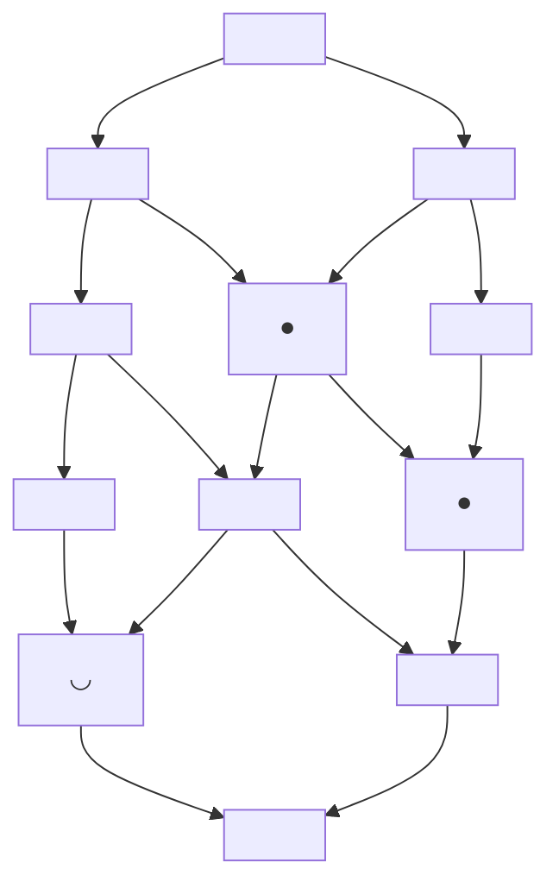

# Notes

```mermaid
graph TD
    A1[" "] --> A2[" "] --> A3[" "]
    B1[" "] --> B2["●"] --> B3["●"]
    C1[" "] --> C2[" "] --> C3[" "]
    D1[" "] --> D2["◡"] --> D3[" "]

    A1 --> B1
    A2 --> B2
    A3 --> B3
    B1 --> C1
    B2 --> C2
    B3 --> C3
    C1 --> D1
    C2 --> D2
    C3 --> D3
```

