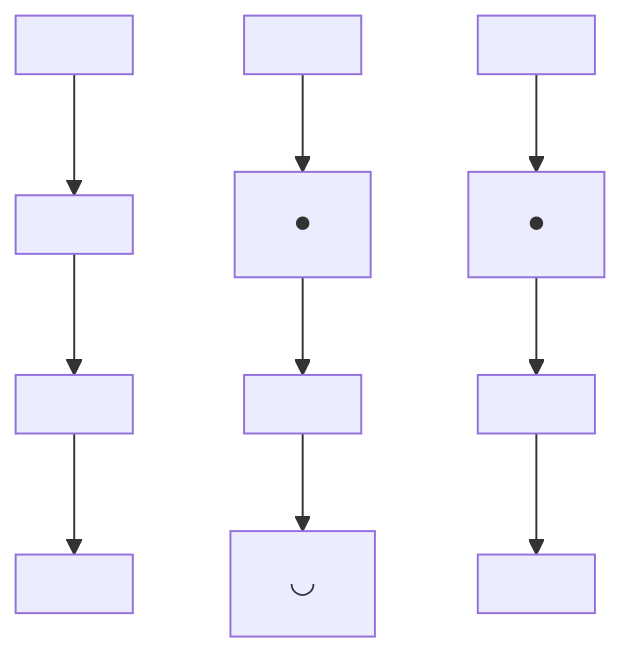

# Notes

```mermaid
graph TB

    %% Row 1 (empty)
    A1[" "] 
    A2[" "] 
    A3[" "]

    %% Row 2 (eyes)
    B1[" "] 
    B2["●"] 
    B3["●"]

    %% Row 3 (nose space)
    C1[" "] 
    C2[" "] 
    C3[" "]

    %% Row 4 (mouth)
    D1[" "] 
    D2["◡"] 
    D3[" "]

    %% Connect rows top to bottom to form grid
    A1 --> B1
    A2 --> B2
    A3 --> B3
    B1 --> C1
    B2 --> C2
    B3 --> C3
    C1 --> D1
    C2 --> D2
    C3 --> D3
```
